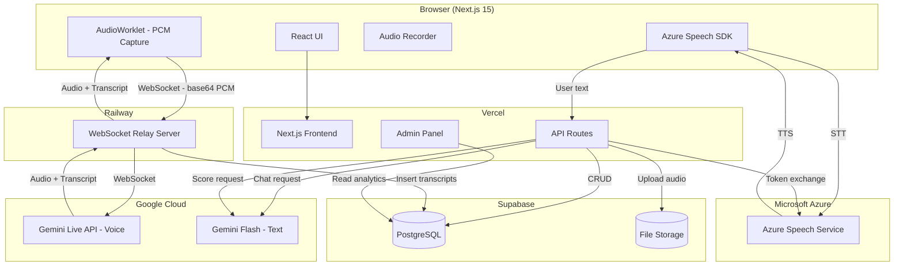
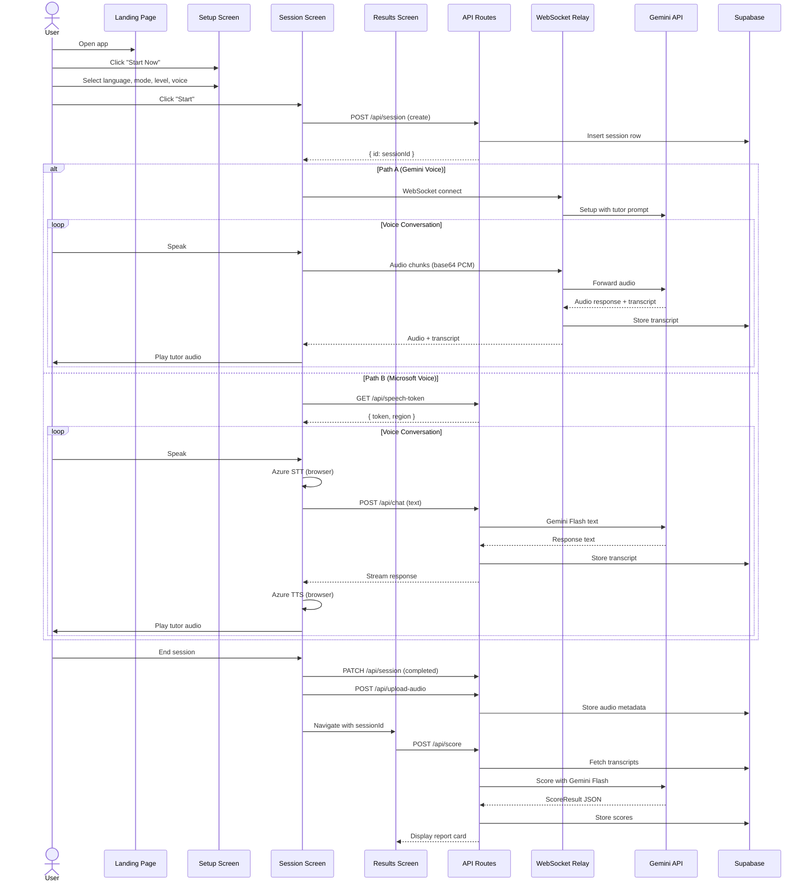
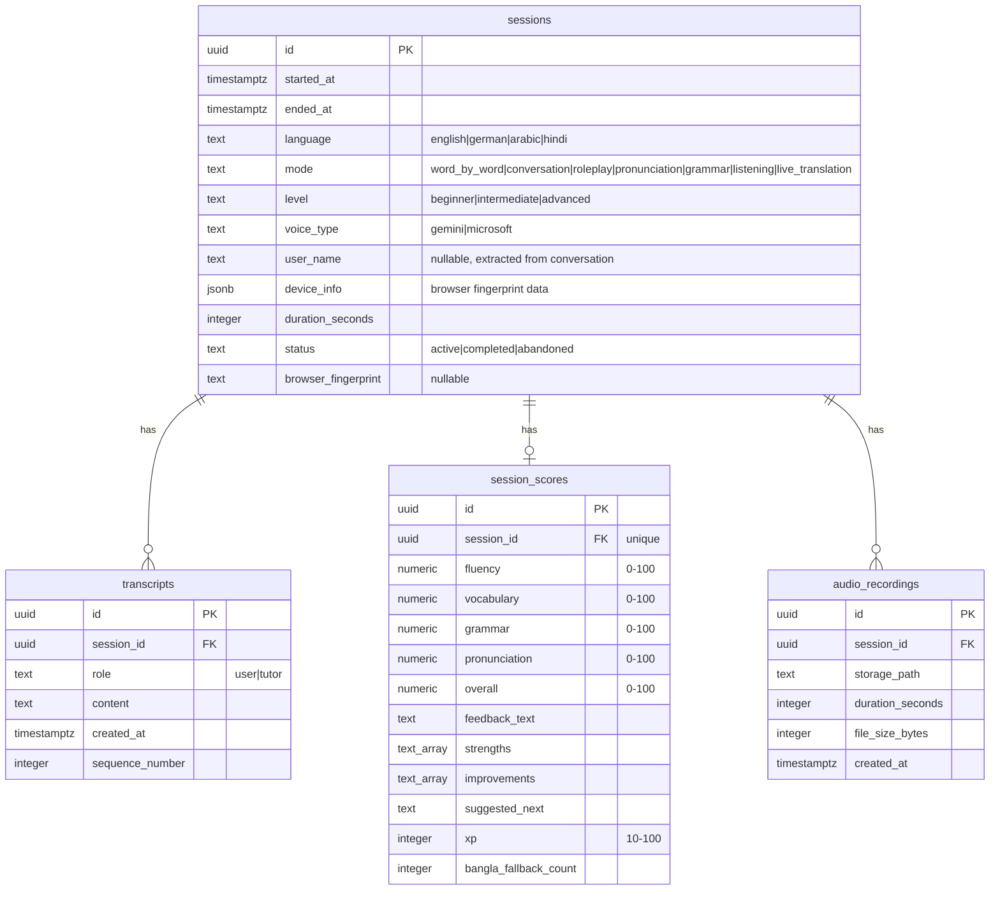
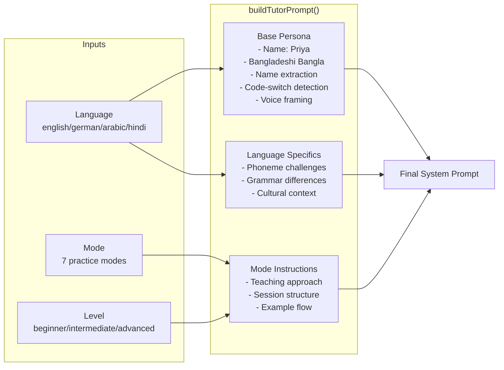
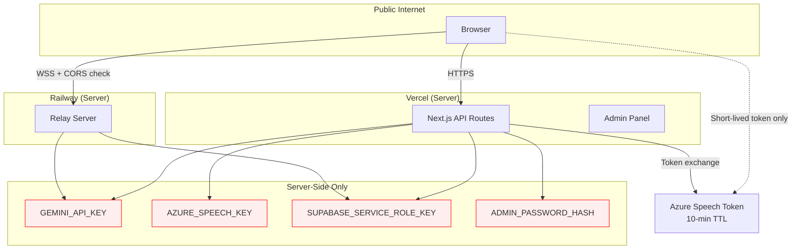
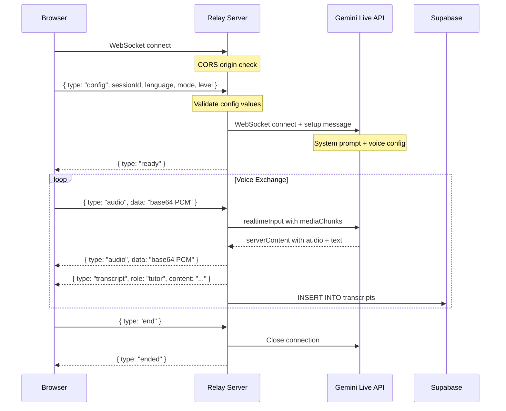
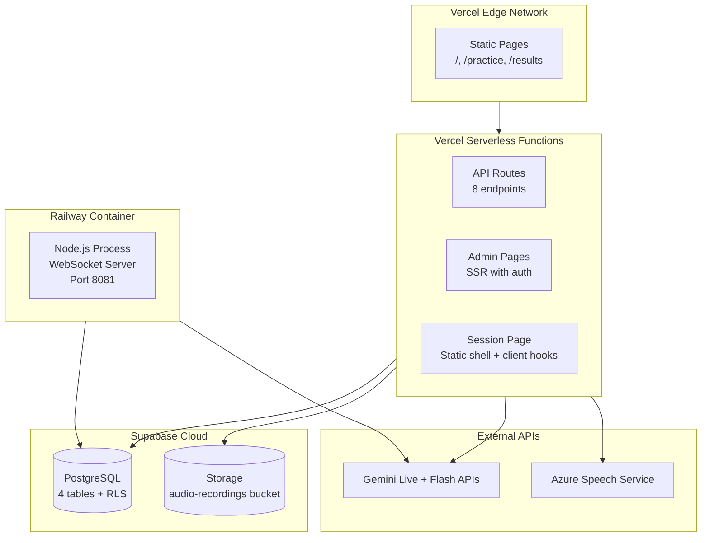

# Architecture and System Design

## High-Level Architecture



## Dual Voice Pipeline

BhashaShikhi offers two voice paths that produce identical session data:

```mermaid
graph LR
    subgraph PathA["Path A: Gemini Voice (Default)"]
        MIC_A[Mic Input] --> WORKLET[AudioWorklet]
        WORKLET -->|PCM base64| WS[WebSocket]
        WS --> RELAY[Relay Server]
        RELAY --> GEMINI[Gemini Live API]
        GEMINI -->|Audio + Text| RELAY
        RELAY -->|Audio| SPEAKER_A[Speaker Output]
        RELAY -->|Transcript| DB_A[(Supabase)]
    end

    subgraph PathB["Path B: Microsoft Voice"]
        MIC_B[Mic Input] --> STT[Azure STT]
        STT -->|Text| CHAT[/api/chat]
        CHAT --> FLASH[Gemini Flash]
        FLASH -->|Text| CHAT
        CHAT -->|Response| TTS[Azure TTS]
        TTS --> SPEAKER_B[Speaker Output]
        CHAT -->|Transcript| DB_B[(Supabase)]
    end
```

### Path A: Gemini Live (Default)

1. Browser captures microphone via `AudioWorklet` (raw PCM at 16kHz)
2. PCM encoded to base64 and sent over WebSocket to Railway relay
3. Relay forwards audio to Gemini Live API with the tutor system prompt
4. Gemini responds with audio chunks + text transcripts
5. Relay stores transcripts in Supabase and forwards audio back to browser
6. Browser plays tutor audio through Web Audio API

### Path B: Microsoft Azure Speech

1. Azure Speech SDK runs in the browser for STT (speech-to-text)
2. Recognized text is sent to `/api/chat` endpoint
3. API route calls Gemini Flash text API with the tutor prompt + conversation history
4. Response streams back to the browser
5. Azure TTS synthesizes the response as audio
6. Transcripts stored via API routes in Supabase

## User Flow



## Component Architecture

```mermaid
graph TB
    subgraph Pages["Pages (src/app/)"]
        LP["/  Landing Page"]
        PP["/practice  Setup Screen"]
        SP["/session  Session Screen"]
        RP["/results  Results Screen"]
        AP["/panel/[slug]  Admin Panel"]
    end

    subgraph Components["Components (src/components/)"]
        subgraph Landing
            Hero[hero.tsx]
            Features[features.tsx]
        end
        subgraph Setup
            LangSel[language-selector.tsx]
            ModeSel[mode-selector.tsx]
            LevelSel[level-selector.tsx]
            VoiceSel[voice-selector.tsx]
        end
        subgraph Session
            VoiceOrb[voice-orb.tsx]
            TransPanel[transcript-panel.tsx]
        end
        subgraph Results
            ScoreCard[score-card.tsx]
            FeedbackPanel[feedback-panel.tsx]
        end
        subgraph Admin
            StatsCard[stats-card.tsx]
            SessionsTable[sessions-table.tsx]
            TransViewer[transcript-viewer.tsx]
        end
    end

    subgraph Hooks["Hooks (src/hooks/)"]
        UseSession[use-session.ts]
        UseGemini[use-gemini-live.ts]
        UseMicrosoft[use-microsoft-speech.ts]
        UseRecorder[use-audio-recorder.ts]
    end

    subgraph Lib["Library (src/lib/)"]
        Constants[constants.ts]
        TutorPrompts[prompts/tutor.ts]
        ScoringPrompts[prompts/scoring.ts]
        SupaClient[supabase/client.ts]
        SupaServer[supabase/server.ts]
        SupaTypes[supabase/types.ts]
        PcmWorklet[audio/pcm-worklet.ts]
    end

    LP --> Hero & Features
    PP --> LangSel & ModeSel & LevelSel & VoiceSel
    SP --> VoiceOrb & TransPanel
    SP --> UseSession
    RP --> ScoreCard & FeedbackPanel
    AP --> StatsCard & SessionsTable & TransViewer

    UseSession --> UseGemini & UseMicrosoft & UseRecorder
    UseGemini --> PcmWorklet
```



## Data Model



## Prompt Architecture

The tutor prompt is constructed dynamically from three dimensions:



### Coverage Matrix

The prompt system covers 84 unique combinations:

- 4 languages x 7 modes x 3 levels = 84 prompts
- Each includes Bengali-speaker-specific phoneme error patterns
- Each includes L1 transfer grammar challenges
- Live Translation mode uses a single translator prompt (level-independent)

## Security Architecture



### Security Measures

| Layer | Measure |
|-------|---------|
| API Keys | Never in client bundles. Server-side only via env vars. |
| Azure Speech | Browser receives 10-minute tokens, never the raw key. |
| Admin Panel | Hidden URL slug + bcrypt password + HTTP-only cookie. |
| CORS | Relay only accepts connections from the Vercel domain. |
| Headers | X-Powered-By removed, X-Frame-Options DENY, strict CSP. |
| Source Maps | Disabled in production. Console logs stripped. |
| Database | Row Level Security on all tables. Service role for API routes only. |
| File Upload | Type validation (audio/* only), size limits enforced. |
| Indexing | robots.txt disallows all, meta noindex on all pages. |

## Relay Server Protocol



## Deployment Topology


