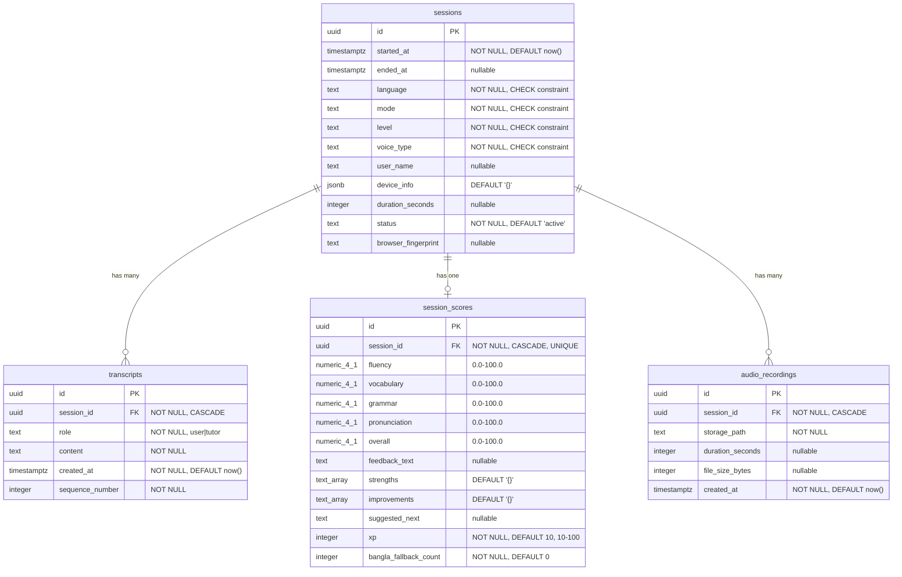

# Database Schema

BhashaShikhi uses Supabase PostgreSQL with Row Level Security (RLS) enabled on all tables.

## Entity Relationship Diagram



## Tables

### sessions

The core table. One row per practice session.

| Column | Type | Constraints | Description |
|--------|------|-------------|-------------|
| `id` | uuid | PK, auto-generated | Session identifier |
| `started_at` | timestamptz | NOT NULL, DEFAULT now() | When the session began |
| `ended_at` | timestamptz | nullable | When the session ended |
| `language` | text | NOT NULL, CHECK | Target language being practiced |
| `mode` | text | NOT NULL, CHECK | Practice mode selected |
| `level` | text | NOT NULL, CHECK | Learner's proficiency level |
| `voice_type` | text | NOT NULL, CHECK | Which voice pipeline was used |
| `user_name` | text | nullable | Extracted from conversation (tutor asks naturally) |
| `device_info` | jsonb | DEFAULT '{}' | Browser/device metadata |
| `duration_seconds` | integer | nullable | Total session length |
| `status` | text | NOT NULL, DEFAULT 'active' | Session lifecycle state |
| `browser_fingerprint` | text | nullable | For repeat visitor tracking |

**CHECK constraints:**

```sql
language IN ('english', 'german', 'arabic', 'hindi')
mode IN ('word_by_word', 'conversation', 'roleplay', 'pronunciation', 'grammar', 'listening', 'live_translation')
level IN ('beginner', 'intermediate', 'advanced')
voice_type IN ('gemini', 'microsoft')
status IN ('active', 'completed', 'abandoned')
```

### transcripts

Stores every utterance from both the user and the AI tutor, in order.

| Column | Type | Constraints | Description |
|--------|------|-------------|-------------|
| `id` | uuid | PK, auto-generated | Transcript entry identifier |
| `session_id` | uuid | FK -> sessions, CASCADE | Parent session |
| `role` | text | NOT NULL, CHECK | Who spoke: `user` or `tutor` |
| `content` | text | NOT NULL | What was said |
| `created_at` | timestamptz | NOT NULL, DEFAULT now() | When it was said |
| `sequence_number` | integer | NOT NULL | Ordering within session |

**Index:** `idx_transcripts_session` on `(session_id, sequence_number)` for fast ordered retrieval.

### session_scores

AI-generated evaluation of the session. One score per session (unique constraint on session_id).

| Column | Type | Constraints | Description |
|--------|------|-------------|-------------|
| `id` | uuid | PK, auto-generated | Score record identifier |
| `session_id` | uuid | FK -> sessions, CASCADE, UNIQUE | Parent session |
| `fluency` | numeric(4,1) | CHECK 0.0-100.0 | How smoothly the learner spoke |
| `vocabulary` | numeric(4,1) | CHECK 0.0-100.0 | Range and accuracy of words |
| `grammar` | numeric(4,1) | CHECK 0.0-100.0 | Sentence structure correctness |
| `pronunciation` | numeric(4,1) | CHECK 0.0-100.0 | Sound clarity and accuracy |
| `overall` | numeric(4,1) | CHECK 0.0-100.0 | Weighted composite score |
| `feedback_text` | text | nullable | 2-3 sentence overall assessment |
| `strengths` | text[] | DEFAULT '{}' | Things done well (with examples) |
| `improvements` | text[] | DEFAULT '{}' | Specific errors with corrections |
| `suggested_next` | text | nullable | Recommended next mode:level |
| `xp` | integer | NOT NULL, DEFAULT 10, CHECK 10-100 | Experience points earned |
| `bangla_fallback_count` | integer | NOT NULL, DEFAULT 0 | Times learner switched to Bangla |

### audio_recordings

Metadata for recorded session audio stored in Supabase Storage.

| Column | Type | Constraints | Description |
|--------|------|-------------|-------------|
| `id` | uuid | PK, auto-generated | Recording identifier |
| `session_id` | uuid | FK -> sessions, CASCADE | Parent session |
| `storage_path` | text | NOT NULL | Path in Supabase Storage bucket |
| `duration_seconds` | integer | nullable | Audio length |
| `file_size_bytes` | integer | nullable | File size |
| `created_at` | timestamptz | NOT NULL, DEFAULT now() | Upload timestamp |

## Row Level Security (RLS)

All tables have RLS enabled. Policies:

| Table | Policy | Access |
|-------|--------|--------|
| All tables | Service role full access | Service role can SELECT, INSERT, UPDATE, DELETE |
| sessions | Anon can insert | Anonymous users can create sessions (from browser via relay) |

The `service_role` key is used by all API routes and the relay server. The `anon` key is only used for initial session creation from the browser.

## Storage

### audio-recordings bucket

- **Visibility:** Private (requires auth token to access)
- **File structure:** `{sessionId}/recording.{ext}`
- **Supported formats:** webm, ogg, mp4, wav

## Migration

The complete schema is in a single migration file:

```
supabase/migrations/001_initial_schema.sql
```

Run this in the Supabase SQL Editor to set up the entire database. The migration is idempotent on first run but will fail if tables already exist.
