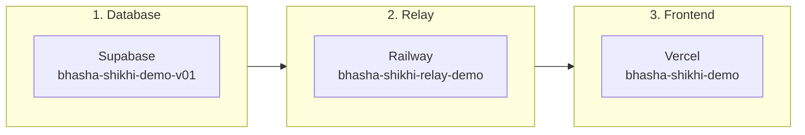

# Deployment Guide

BhashaShikhi v0.1 demo is deployed across three platforms.

## Current Deployment

| Service | Platform | Account | Project Name | URL |
|---------|----------|---------|-------------|-----|
| Frontend + API | Vercel | ratul.kuet@gmail.com (team: ratulalahy) | bhasha-shikhi-demo | https://bhasha-shikhi-demo.vercel.app |
| WebSocket Relay | Railway | qratul@uvu.edu | bhasha-shikhi-relay-demo | https://bhasha-shikhi-relay-demo-production.up.railway.app |
| Database + Storage | Supabase | -- | bhasha-shikhi-demo-v01 (ref: hstqzvhawnokvethhdla) | https://supabase.com/dashboard/project/hstqzvhawnokvethhdla |
| Source Code | GitHub | cognidrift-web-apps | bhasha-shikhi | https://github.com/cognidrift-web-apps/bhasha-shikhi |

### Dashboard Links

- **Vercel**: https://vercel.com/ratulalahy/bhasha-shikhi-demo
- **Railway**: https://railway.com/project/0b03a7ea-cbd9-4be6-982b-f4e4b20ace43
- **Supabase**: https://supabase.com/dashboard/project/hstqzvhawnokvethhdla
- **GitHub PR**: https://github.com/cognidrift-web-apps/bhasha-shikhi/pull/1

## Architecture



Set up in order: Supabase first (both others need its URL/keys), then Railway (Vercel needs the relay URL), then Vercel.

## Environment Variables

### Vercel (6 variables)

| Variable | Scope | Description | Set? |
|----------|-------|-------------|------|
| `NEXT_PUBLIC_SUPABASE_URL` | Public | Supabase project URL | Yes |
| `NEXT_PUBLIC_SUPABASE_ANON_KEY` | Public | Supabase anon key | Yes |
| `NEXT_PUBLIC_WS_RELAY_URL` | Public | `wss://bhasha-shikhi-relay-demo-production.up.railway.app` | Yes |
| `SUPABASE_SERVICE_ROLE_KEY` | Server | Supabase service role key | Yes |
| `GEMINI_API_KEY` | Server | Google Gemini API key | Yes |
| `ADMIN_ROUTE_SLUG` | Server | `bhasha-panel-x7k9m2` | Yes |
| `ADMIN_PASSWORD_HASH` | Server | bcrypt hash | Yes |
| `AZURE_SPEECH_KEY` | Server | Azure Speech key | Not yet |
| `AZURE_SPEECH_REGION` | Server | Azure region (e.g., eastus) | Not yet |

### Railway (7 variables)

| Variable | Description | Set? |
|----------|-------------|------|
| `GEMINI_API_KEY` | Google Gemini API key | Yes |
| `GEMINI_MODEL` | `gemini-2.5-flash-preview-native-audio-dialog` | Yes |
| `GEMINI_VOICE` | `Kore` | Yes |
| `SUPABASE_URL` | Supabase project URL | Yes |
| `SUPABASE_SERVICE_ROLE_KEY` | Supabase service role key | Yes |
| `ALLOWED_ORIGINS` | `https://bhasha-shikhi-demo.vercel.app,http://localhost:3000` | Yes |
| `PORT` | `8081` | Yes |

## Setting Up From Scratch

If you need to recreate the deployment (new accounts, new project):

### 1. Supabase Setup

1. Go to [supabase.com](https://supabase.com) and create a new project
2. Note **Project URL**, **anon key**, and **service role key** from Settings > API
3. Run the migration using the Supabase CLI:

```bash
npx supabase login
npx supabase link --project-ref <your-project-ref>
SUPABASE_ACCESS_TOKEN=<your-token> npx supabase db query --linked -f supabase/migrations/001_initial_schema.sql
```

This creates 4 tables (`sessions`, `transcripts`, `session_scores`, `audio_recordings`), enables RLS, and creates the `audio-recordings` storage bucket.

### 2. Railway Setup (WebSocket Relay)

1. Install Railway CLI: `brew install railway` or `npm i -g @railway/cli`
2. Login: `railway login`
3. Create project: `railway init --name bhasha-shikhi-relay-demo`
4. Link: `railway link --project <project-id>`
5. Deploy from the `relay/` directory:

```bash
cd relay
railway up --detach --service <service-name>
```

6. Set environment variables:

```bash
railway variables set \
  GEMINI_API_KEY='<key>' \
  GEMINI_MODEL='gemini-2.5-flash-preview-native-audio-dialog' \
  GEMINI_VOICE='Kore' \
  SUPABASE_URL='<url>' \
  SUPABASE_SERVICE_ROLE_KEY='<key>' \
  ALLOWED_ORIGINS='https://your-app.vercel.app,http://localhost:3000' \
  PORT='8081' \
  -s <service-id>
```

7. Generate domain: `railway domain -s <service-id>`
8. Redeploy: `railway up --detach --service <service-name>`

### 3. Vercel Setup (Next.js App)

1. Install Vercel CLI: `npm i -g vercel`
2. Login: `vercel login`
3. Link: `vercel link --yes --project bhasha-shikhi-demo --scope <team>`
4. Set environment variables:

```bash
vercel env add NEXT_PUBLIC_SUPABASE_URL production --value '<url>' --yes
vercel env add NEXT_PUBLIC_SUPABASE_ANON_KEY production --value '<key>' --yes
vercel env add NEXT_PUBLIC_WS_RELAY_URL production --value 'wss://<railway-domain>' --yes
vercel env add SUPABASE_SERVICE_ROLE_KEY production --value '<key>' --yes
vercel env add GEMINI_API_KEY production --value '<key>' --yes
vercel env add ADMIN_ROUTE_SLUG production --value '<slug>' --yes
vercel env add ADMIN_PASSWORD_HASH production --value '<hash>' --yes
```

5. Deploy: `vercel deploy --prod --yes`

### Generate Admin Password Hash

```bash
node -e "const b=require('bcryptjs');b.hash('your-password',10).then(h=>console.log(h))"
```

## CI/CD

GitHub Actions runs on every push to `main` and `feat/*` branches, and on PRs to `main`:

- **Test**: runs `npm test` (255 tests)
- **Build**: runs `npm run build` (Next.js production build)
- **Relay Build**: runs `cd relay && npm run build`

Config: `.github/workflows/ci.yml`

Note: Vercel is NOT connected to GitHub via git integration (requires Pro plan for org repos). Deployments are done manually via `vercel deploy --prod`.

## Local Development

```bash
# Terminal 1: Next.js
npm run dev

# Terminal 2: Relay
cd relay && npm run dev
```

```bash
cp .env.local.example .env.local    # Next.js env vars
cp relay/.env.example relay/.env    # Relay env vars
```

For local development, use `ALLOWED_ORIGINS=http://localhost:3000` in the relay's `.env` and `NEXT_PUBLIC_WS_RELAY_URL=ws://localhost:8081` in `.env.local`.

## Health Checks

```bash
# Frontend
curl https://bhasha-shikhi-demo.vercel.app
# Expected: 200

# Relay
curl https://bhasha-shikhi-relay-demo-production.up.railway.app/health
# Expected: {"status":"ok"}
```

## Cleanup (Deleting the Demo)

To remove the demo deployment:

1. **Vercel**: Dashboard > bhasha-shikhi-demo > Settings > Delete Project
2. **Railway**: Dashboard > bhasha-shikhi-relay-demo > Settings > Delete Project
3. **Supabase**: Dashboard > bhasha-shikhi-demo-v01 > Settings > General > Delete Project

## Troubleshooting

### Voice Not Working

1. Check browser console for WebSocket errors
2. Verify relay is healthy: `curl https://bhasha-shikhi-relay-demo-production.up.railway.app/health`
3. Check Railway logs for Gemini API errors
4. Verify `ALLOWED_ORIGINS` on Railway includes the Vercel domain

### Scoring Returns Zeros

1. Verify `GEMINI_API_KEY` is set on Vercel
2. Check that transcripts were saved (admin panel > session detail)
3. Check Vercel function logs for Gemini API errors

### Admin Login Fails

1. Verify URL matches `ADMIN_ROUTE_SLUG` (`bhasha-panel-x7k9m2` for demo)
2. Verify `ADMIN_PASSWORD_HASH` was generated with bcryptjs
3. Try regenerating: `node -e "require('bcryptjs').hash('your-password',10).then(console.log)"`

### Railway 502 Errors

1. Check `railway logs --service bhasha-shikhi-relay-demo`
2. Common cause: missing env vars. Verify with `railway variables list`
3. Redeploy: `cd relay && railway up --detach --service bhasha-shikhi-relay-demo`
