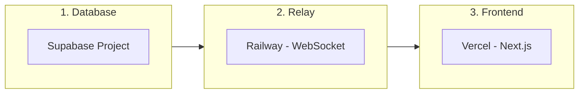

# Deployment Guide

BhashaShikhi deploys across three platforms. Each can be set up independently.

## Overview



Set up in order: Supabase first (both others need its URL/keys), then Railway (Vercel needs the relay URL), then Vercel.

## 1. Supabase Setup

### Create Project

1. Go to [supabase.com](https://supabase.com) and create a new project
2. Note your **Project URL** and **API keys** (anon key + service role key) from Settings > API

### Run Migration

In the Supabase SQL Editor, paste and run the contents of:

```
supabase/migrations/001_initial_schema.sql
```

This creates 4 tables (`sessions`, `transcripts`, `session_scores`, `audio_recordings`), enables RLS, and creates the `audio-recordings` storage bucket.

### Verify

- Tables should appear under Table Editor
- Storage bucket `audio-recordings` should appear under Storage
- RLS policies should be active (check Authentication > Policies)

## 2. Railway Setup (WebSocket Relay)

### Create Service

1. Go to [railway.app](https://railway.app)
2. Create a new project
3. Deploy from the repository, set the **root directory** to `relay/`
4. Railway will detect the Dockerfile automatically

### Environment Variables

Set these in the Railway service settings:

| Variable | Value | Notes |
|----------|-------|-------|
| `GEMINI_API_KEY` | Your Google Gemini API key | Get from [aistudio.google.com](https://aistudio.google.com) |
| `GEMINI_MODEL` | `gemini-2.5-flash-preview-native-audio-dialog` | Default voice model |
| `GEMINI_VOICE` | `Kore` | Gemini voice name |
| `SUPABASE_URL` | Your Supabase project URL | From step 1 |
| `SUPABASE_SERVICE_ROLE_KEY` | Your Supabase service role key | From step 1 |
| `ALLOWED_ORIGINS` | `https://your-app.vercel.app` | Comma-separated for multiple |
| `PORT` | `8081` | Railway exposes this automatically |

### Verify

After deployment, check the health endpoint:

```bash
curl https://your-relay.railway.app/health
# Expected: {"status":"ok"}
```

Note the Railway URL -- you need it for the Vercel setup.

## 3. Vercel Setup (Next.js App)

### Deploy

1. Go to [vercel.com](https://vercel.com)
2. Import the repository
3. Framework preset: Next.js (auto-detected)
4. Root directory: `.` (project root, not `relay/`)

### Environment Variables

Set these in Vercel project settings:

| Variable | Value | Notes |
|----------|-------|-------|
| `NEXT_PUBLIC_SUPABASE_URL` | Your Supabase project URL | Public (used in browser) |
| `NEXT_PUBLIC_SUPABASE_ANON_KEY` | Your Supabase anon key | Public (used in browser) |
| `SUPABASE_SERVICE_ROLE_KEY` | Your Supabase service role key | Server-side only |
| `NEXT_PUBLIC_WS_RELAY_URL` | `wss://your-relay.railway.app` | Public WebSocket URL |
| `GEMINI_API_KEY` | Your Google Gemini API key | Server-side only |
| `AZURE_SPEECH_KEY` | Your Azure Speech key | Server-side only |
| `AZURE_SPEECH_REGION` | `eastus` (or your region) | Server-side only |
| `ADMIN_ROUTE_SLUG` | A random string (e.g. `panel-x7k9m2`) | Hidden admin URL |
| `ADMIN_PASSWORD_HASH` | bcrypt hash of your password | Generate below |

### Generate Admin Password Hash

```bash
node -e "const b=require('bcryptjs');b.hash('your-password',10).then(h=>console.log(h))"
```

Copy the output (starts with `$2a$`) and set it as `ADMIN_PASSWORD_HASH`.

### Update Railway CORS

After Vercel deployment, update the `ALLOWED_ORIGINS` on Railway to include your Vercel domain:

```
ALLOWED_ORIGINS=https://your-app.vercel.app,http://localhost:3000
```

### Verify

1. Open `https://your-app.vercel.app` -- landing page should load
2. Click "Start Now" -- setup screen should show
3. Navigate to `https://your-app.vercel.app/panel/your-slug` -- login page should show

## API Key Sources

| Key | Where to Get It |
|-----|----------------|
| Gemini API Key | [Google AI Studio](https://aistudio.google.com/apikey) |
| Azure Speech Key | [Azure Portal](https://portal.azure.com) > Speech Services |
| Supabase Keys | Supabase Dashboard > Settings > API |

### Azure Speech Setup

1. Create a Speech Service resource in Azure Portal
2. Choose a region (e.g., `eastus`)
3. Copy Key 1 and the region
4. The key is used server-side only; the browser receives short-lived tokens

### Gemini API Setup

1. Go to Google AI Studio
2. Create an API key
3. The same key is used for both Gemini Live (relay) and Gemini Flash (API routes)
4. Ensure the key has access to `gemini-2.5-flash-preview-native-audio-dialog` model

## Local Development

### Full Stack

```bash
# Terminal 1: Next.js
npm run dev

# Terminal 2: Relay
cd relay && npm run dev
```

### Environment Files

```bash
cp .env.local.example .env.local    # Next.js env vars
cp relay/.env.example relay/.env    # Relay env vars
```

For local development, set `ALLOWED_ORIGINS=http://localhost:3000` in the relay's `.env`.

## Monitoring

### Health Checks

- **Relay**: `GET https://your-relay.railway.app/health` returns `{"status":"ok"}`
- **Vercel**: Vercel provides automatic health monitoring
- **Supabase**: Dashboard shows real-time database metrics

### Admin Dashboard

Navigate to `https://your-app.vercel.app/panel/your-slug` to view:
- Total session count
- Sessions today / this week
- Average scores
- Per-session transcripts and audio playback

## Troubleshooting

### Voice Not Working

1. Check browser console for WebSocket errors
2. Verify `NEXT_PUBLIC_WS_RELAY_URL` starts with `wss://`
3. Verify `ALLOWED_ORIGINS` on Railway includes your Vercel domain
4. Check Railway logs for Gemini API errors

### Scoring Returns Zeros

1. Verify `GEMINI_API_KEY` is set on Vercel
2. Check that transcripts were saved (admin panel > session detail)
3. Check Vercel function logs for Gemini API errors

### Azure Speech Not Working

1. Verify `AZURE_SPEECH_KEY` and `AZURE_SPEECH_REGION` are set on Vercel
2. Test token endpoint: `curl https://your-app.vercel.app/api/speech-token`
3. Check browser console for SDK initialization errors

### Admin Login Fails

1. Verify `ADMIN_ROUTE_SLUG` matches the URL path
2. Verify `ADMIN_PASSWORD_HASH` was generated with bcryptjs (not bcrypt)
3. Try regenerating the hash with the command above
